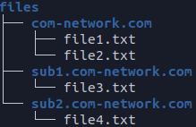

# Project Description: Application layer and socket programming

In this project, you are going to implement a web system using python. A web system in its simplest form comprises three components. These components are web client, web server, and DNS server. In the real world, each of the mentioned components is an intricate software system with enormous implementation considerations, but here you will implement a simplified version of these systems.

 
In this simplified web system, a user enters a request using the web client. Then web client finds the request’s destination IP address and port from the DNS server. After that, the web client sends a request to the appropriate web server, and the web server searches in its file directory for the requested file. If the file exists, it sends back found file. Otherwise, replies with a 404 NOT FOUND.

## Part 1: DNS server
In a nutshell, DNS severs’ job is to receive domain names like google.com and translate them into IP addresses. In this part, you will implement software that uses a textbase file as its database, and whenever a request comes tries to translate the domain name stated in the request into an IP address and a port number and return these two to the client.
A single domain can have so many subdomains. As an example, take kntu.ac.ir as a domain. This domain has multiple subdomains like vc.kntu.ac.ir for its online class platform, ee.kntu.ac.ir for its electrical engineering website, and so on.
Here you will use a JSON file as the database for the DNS server. An example of this file in this project is as follow:

    {  
       "root": {  
           "domains": {  
               "com-network.com": {  
                   "ip": "192.168.1.103",  
                   "port": "8080",  
                   "domains": {
                       "sub1.com-network.com": {
                           "ip": "192.168.1.107",
                           "port": "8080",
                           "domains": {}
                       },
                       "sub2.com-network.com": {
                           "ip": "192.168.1.109",
                           "port": "8081",
                           "domains": {}
                       }
                   }
               }
           }
       }
    }

Notes
1.	The file above is an example of your database for the DNS server, and you should only use the structure of it.
2.	DNS server runs above UDP protocol and port 53, but you should use port 5353 in this project.
3.	In communication with this DNS server, you can adopt whatever format (message structure) you like.
4.	Your program should be able to cope with dynamic changes of this file during runtime. So, for example, if we change one IP when the server is active, we must get the updated IP in subsequent responses.
5.	Use arguments for setting your configurations instead of hard-coding them like port numbers.

Steps
1.	Generate a JSON file as your database and put it in your DNS server directory.
2.	Create a UDP socket with port 5353.
3.	Listen and wait for incoming requests on this port.
4.	Whenever you receive a request:
a.	Validate it if it’s invalid drop it (here, you have to validate the incoming request with your desired message structure).
b.	Otherwise, look in your database for request objectives.
c.	Create a response and send it back to the client.
5.	Now update your DNS server to work with the standard DNS query structure. (Compare requests and responses of your DNS server with their real-world counterparts using WireShark or tcpdump).
6.	Update your DNS server to work with multiple threads. (Implement a scenario to test if your DNS server can handle multiple simultaneous requests after this step)
7.	Use a Thread pool and a queue to schedule requests for using available threads in the thread pool. (Log details of scheduling and thread assignments and ascertain whether your design works correctly or not)
8.	Implement a load balancing scheme with DNS entries. (Log details of load balancing and your algorithm for it)

## Part 2: Web Server
Your web server listens on port 8080 for any incoming HTTP requests. After receiving a request, this server looks in its file directories for requested files. If it finds the requested file, send back that file. Otherwise, it sends back 404 NOT FOUND. A sample file directory structure for this web server can be seen below.

 
As you can see, this sample directory structure has similarities to our previous example, which was the DNS server’s database file.

Notes
1.	We have to be able to modify the files directory at runtime without restarting the server. These modifications comprise:
a.	Adding new domain directory
b.	Editing existing domains name
c.	Deleting existing domain
d.	Adding new file in any domain directory
e.	Editing any file in any domain directory.
f.	Deleting any file in any domain directory.
2.	Use arguments for setting your configurations instead of hard-coding them. Like port numbers.
Steps
1.	Create a file directory and generate some random files, and put them in your files directory.
2.	Create a TCP socket listening on port 8080.
3.	Listen and wait for incoming requests on this socket.
4.	Whenever you receive a request:
a.	Validate it to be a valid HTTP request.
b.	Parse its parameters and extract request file names.
c.	If you found these files in the appropriate domain, send them back to the client.
d.	Otherwise, send 404 NOT FOUND.
5.	Update your webserver to work with multiple threads. (Implement a scenario to test if your DNS server can handle multiple simultaneous requests after this step)
6.	Use a Thread pool and a queue to schedule requests for using available threads in the thread pool. (Log details of scheduling and thread assignments and ascertain whether your design works correctly or not)

## Part 3: Web Client
In the real world, web clients are mostly web browsers, but you will implement an interactive console-based web application in this project. This web client has three commands.
1.	exit
2.	http
3.	dns

with the exit command user simply closes the client app. The dns command is used when the user wants to send a DNS query to its DNS server. Usage of this command is as follow:

**dns google.com**

The result of this command can be like this:

**[result] dns query result for google.com is 10.43.1.60 with port 80**

The last command is http. Using this command, you can send HTTP GET requests. An example of this command is:

**http com-network.com/tests?file=test.txt**

In this request, the web server looks for test.txt inside folder tests. The folder tests itself must be inside the domain folder com-network.com. Upon receiving the response from the web server, the client will print the received response in the terminal.

Notes
1.	The user has to be able to request multiple files with one HTTP request entering multiple file parameters.
2.	Web client must send the standard HTTP requests to the web server.
3.	You have to implement a mechanism for sending parallel requests to test your web server and DNS server (if you support it there)

Steps
1.	Wait for the user to enter a command.
2.	Upon receiving a command from the user, do as explained.
3.	Print received result
4.	Repeat steps 1 to 3 until the user enters the exit command.

Submission
1.	You are not allowed to use any non-standard python library in the project. (non-standard libraries are the ones you have to download them to use)
2.	Include a self-explanatory report in submission.
3.	In your report, explicitly state which parts of the project have been implemented and which have not.
4.	Include any kind of information that you think will help us to understand better what you have done. Like figures, diagrams, etc.
5.	Start early.
6.	Groups are not allowed.

Update 1
1.	We will consider bonus points for projects using Object Oriented Programming (OOP) in their implementations.
2.	Include a complete walk-through for running the project in your report. (You’ll not get any point if you don’t include this walk-through)
